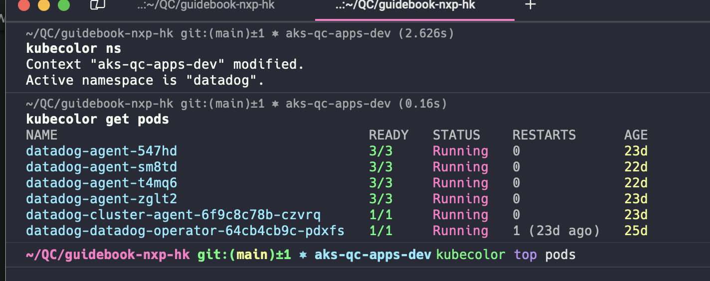
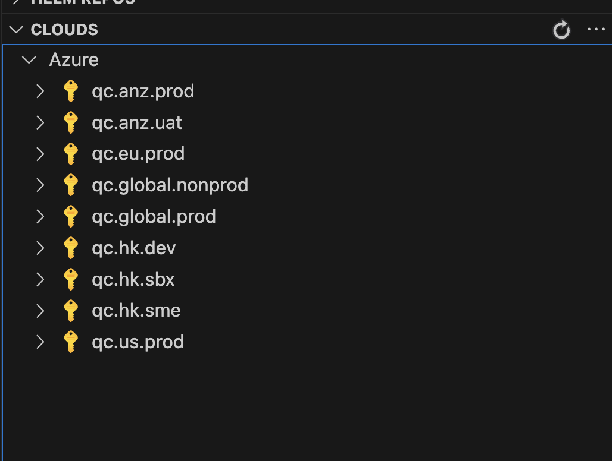

# Introduction to Kubernetes <!-- omit in toc -->

Table of Contents

- [What is it?](#what-is-it)
- [Prerequisites](#prerequisites)
- [Declarative Design](#declarative-design)
- [Common Resources](#common-resources)
- [Tools](#tools)
- [AOB](#aob)
- [Checkpoints](#checkpoints)
- [Reference](#reference)

## What is it?

Kubernetes (K8S) automates administrative work that will make sure containerized applications running correctly

K8S can:

- monitor applications
- decide applications deploying to what server(s)
- restart applications if they are not working
- upscale applications based on cpu &  memory usage
- generate / re-new certificates for HTTPS
- provide manifests setting up virtual networks
- etc...

## Prerequisites

- What is Virtual Machine?
  - supervisor
  - GuestOS vs HostOS
- What is Container?
  - container runtime engine and/or container runtime
  - cgroup V2
  - namespace
- What is infrastructure as code? What is declarative infrastructure?
- What is CloudNative?

## Declarative Design

Everything in K8S is a resource

Resource is defined by manifest file in yaml format

Resources can modify other resources by matching the annotations

## Common Resources

- configmaps
  - configuration management
- **deployments**
  - abstraction of `pods` AND `replicasets`
- horizontalpodautoscalers
  - update the number of live pods should have based on cpu and memory usage
- **ingresses**
  - expose `pods` ports to external network
- jobs
  - an containerized application that will run once only
- namespaces
  - isolate different resources in a logical way
- nodes
  - refers to actual servers / virtual machines
- pods
  - refers to actual containerized application(s)
- replicasets
  - increase / decrease the number of live pods available specified
- secrets
  - similar to `configmaps`, with base64 encoded, values not shown in K8S logs
- **services**
  - abstraction of virtual network configuration

## Tools

- **kubectl**
  - a command line tool for administration
  - provide commands to work with K8S clusters for administrative purpose
  - provide extended features through plugin systems (krew)
  - check [K8S Administration](../how-we-operate/kubernetes-admin.md#kubernetes-administration)

  

  ```bash
    kubectl get pods
    kubectl describe pod smartpod-1234
    kubectl stern smartpod
    kubectl ns
    kubectl ctx
  ```

- **[VSCode Plugin - Azure Kubernetes Service](https://marketplace.visualstudio.com/items?itemName=ms-kubernetes-tools.vscode-aks-tools)**
  - a plugin for VSCode & AKS for debugging
  - provide features with **UIs**
  - check [AKS Extensions](https://code.visualstudio.com/docs/azure/aksextensions)

  

  *- Go to `Kubernetes` -> `Clouds` -> Sign in with AD Account*

- **[helm](https://helm.sh)**
  - a command line tool for deployment
  - the most popular one
  - support template-based with inline scripting
  - support release management
  - this is what we are currently using

- [kustomize](https://kustomize.io)
  - a command line tool for deployment
  - a built-in tool provided by `kubectl`

- [nelm](https://github.com/werf/nelm)
  - the new kid (Year 2024 Sept)
  - aim at replacing `helm`
  - check [Nelm](https://itnext.io/finally-a-viable-helm-replacement-388d538f9e1f)

## AOB

- [VSCode Plugin - Azure Tools](https://marketplace.visualstudio.com/items?itemName=ms-vscode.vscode-node-azure-pack) - provide UIs for other commonly used Azure resources

## Checkpoints

- Name three resources in K8S that can make a container app to be callable externally?
- What tools can you use to interact with K8S?
- How can you get into certain pod?

## Reference

- [Kubernetes Official Website](https://kubernetes.io)
